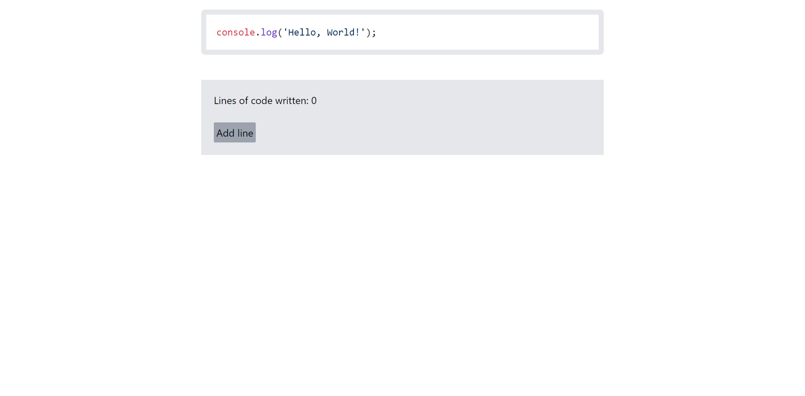
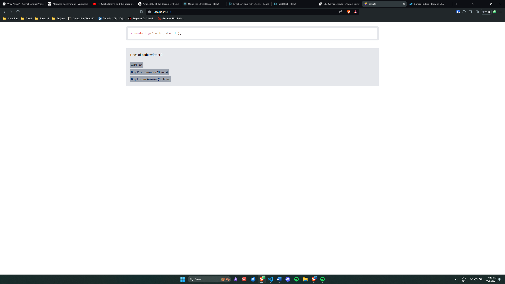

# Exercise: `scrip.ts`
- Exercise directory: `/exercises/idle-game`
- Sample answer: `/exercise-solutions/idle-game`

With the power of `useState` and `useEffect`, we are going to make a small **idle game**.

An **idle game** (also known as an **incremental game**) is a game that slowly gets the
player to gain resources automatically - and thus, "idle" from the game and make progress.
Some examples of idle games are:
- [**Cookie Clicker**](https://orteil.dashnet.org/cookieclicker/) - perhaps the most famous
idle game of them all, players click cookies to buy grandmas to bake cookies, farms to dig
cookies out of the ground... all to get as many cookies as humanly possible.
- [**A Dark Room**](https://adarkroom.doublespeakgames.com/) - a minimal, text-based take on
the genre, where you slowly gain resources to advance further and further along an
overarching story.
- [**Clicker Heroes**](https://www.clickerheroes.com/) - increase your damage per second and
defeat stronger and stronger monsters.
- [**Asbury Pines**](https://store.steampowered.com/app/2212790/Asbury_Pines/) - a murder
mystery that uses the mechanics of idle games.

If you want to find more interesting games in the genre, have a look at [r/incremental_games](https://www.reddit.com/r/incremental_games/).

## Premise

You are a software engineer, who has been tasked to write thousands... nay,
*millions* of lines of code for the company's next big thing™️. Easier said than
done... the end is nowhere in sight. However, ever the optimiser, you decide to
code up some tools that can help you get closer and closer to your goal. Do
you have what it takes to be the next tech superstar?

This is... `scrip.ts`.

## Setting up

Before running the app, make sure you have NPM installed (preferably the latest
version).

To run the app itself, run `npm run dev`. Your game looks something like this: 

## Tasks

You will need to implement all of your functionality in the functional component
`App`. At the end of all of these exercises, your finished SPA should look something
like this: 

See the game in action [here](images/game.mp4).

> This exercise uses **TypeScript** instead of JavaScript. You do not need to worry
> too much about types - most of the code to do with types has already been set up
> for you. If any task does need TypeScript-specific syntax, it will be highlighted
> for you.

### Task 1: Counting lines

Let's first begin by implementing the line counter and the "Add lines" button.

Use `useState` to keep track of the number of lines we've gained, and wire that up to
the button such that every time we click the button, the number of lines increments.

### Task 2: Making it prettier

Making a number go up is cool and all, but it doesn't have enough pizzazz - our next
task is to make the "line of code display" at the very top change whenever we add
a new line of code.

> **NOTE**: We are *not* triggering a change whenever we press the button, that is
> not quite what we want! We want a change whenever the number of lines of code changes
> because in future tasks we're going to be implementing the "idle" part of our idle
> game - allowing the player to buy upgrades which "write lines of code" for them.

Some things have already been implemented for you:

- In the `components` folder, there is a component called `Highlight` - if you
  give it a line of code and the programming language that line is in, a line with
  correct syntax highlighting will be displayed.
- If you look carefully at `Highlight`, you'll see that the line and the programming
  language are represented with something called a `Line`. This is a **type**, which
  is a lot like a C `struct` definition. We use types so that if your text editor
  is smart enough, it can catch errors before you even run your program.
- In `App.tsx`, `getRandomLine()` is a function that looks through all the files in
  `public/code` (the details of which are defined in the constant `CODE_FILES`) and
  spits out a random `Line`, to be used in `Highlight`.

It's your job to piece together all these provided functions and components to trigger
an update of `Highlight` every time we gain a new line of code.

### Task 3: Upgrades

We've got a button that makes a number go up, but we're missing the "idle" part
of our idle game. Now we need a way for our player to buy items that can "click"
our button for us.

In the sample solution, we have the following two **resources**:
- The *programmer* produces 0.1 lines of code per second, and costs 20 lines.
- The *forum answer* produces 0.3 lines of code per second, and costs 50 lines.

After each purchase, the price of an resource will go up by **10%** - so after we
purchase our first programmer, the next programmer will cost 22 lines.

For this task, you will need to keep track of the number of each type of resource,
as well as the price to buy another resource.

To encapsulate all the information a resource could contain, a `Resource` type has
been set up for you in `types.ts`:

```ts
export type Resource = {
  // The name of the item we want to buy
  name: string,
  // How much it increases our lines per second (LPS) by
  increase: number,
  // The number of this type of item we have
  amount: number,
  // How much it costs
  cost: number,
};
```

### Task 4 (extension): The "idle" part

Now comes the hard part - having the number *automatically* go up based on what
resources the player has purchased.

The easiest way to increment our "number of lines" is to calculate how much we
increment by every second (e.g. if we have two programmers and one forum answer,
we will get 0.5 lines every second), and to set up a function to add that increment
every second. This is where the `setInterval()` function in vanilla JS can come
in handy. From the [official docs](https://developer.mozilla.org/en-US/docs/Web/API/setInterval) (emphasis mine):

> The `setInterval()` method... **repeatedly calls a function** or executes a code
> snippet, with a fixed time delay between each call.

Because this is an extension task, we will be covering an aspect of `useEffect`
that isn't on the [main explainer](index.md). Specifically, `useEffect` can
*return a function* - what happens is, whenever the dependency array of an `useEffect`
changes, before re-rendering, the return function gets called. For example:

```jsx
useEffect(() => {
  /* ... */
  return () => console.log("Changing!");
}, [foo]);
```

Whenever `foo` changes, we will see `Changing!` printed to the console.

This feature of `useEffect` is especially important for this task - whenever we
buy a new resource, we also want to change how much we increment our line counter
by every second. Depending on how you choose to update that increment, you may find
that you need to remove the old "loop" somehow - another built-in JS function,
[`clearInterval()`](https://developer.mozilla.org/en-US/docs/Web/API/clearInterval),
may be useful.

> You may notice that floating-point arithmetic messes up the game by a fair bit -
> a *bonus challenge* would be to still increment the number of lines by the correct
> amount every second (which could be a decimal amount), but only display an integer
> number of lines, and only update the code block when a *whole* number of lines
> changes.
>
> You may find the type `LineState` can come in handy.
