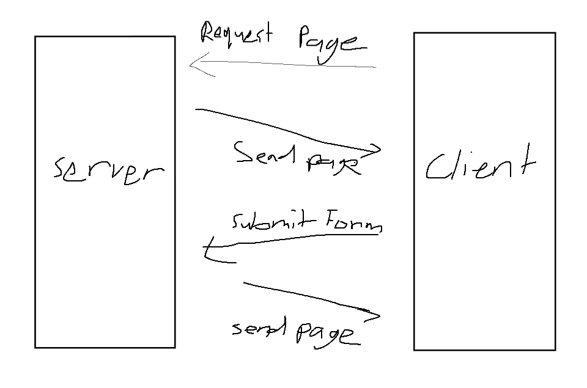

# A Walk Through Webdev History🚶 
### Authors: Dylan Huynh
Note: You'll probably never get use the frameworks that we're working through today. However I hope that by trying these frameworks that you'll learn something new about webdev! 
### Summary
In these set of exercises were going to cover some webdev approaches that used to be fairly popular. 

We'll be covering

- Templating
- HTML Forms (Briefly)
- AJAX

To explore these ideas we will be using **Flask**, a python framework.

# Part 1 - Project Setup
This section will be a abridged version of the flask setup docs avaliable here


Running the application
``` sh
.venv\Scripts\activate
flask run # Will run app.py as a default
```
# Part 2 - Templates
As a basis, servers will transfer a html page to a client to be displayed.

However sending a single prewritten html page isn't particuarily useful. So over time software was constructed to dynamically create html pages to serve to the client.


As you can see templates can be useful for allowing for some changes on the pages, however they don't allow for any interativity on the users end.
# Part 3 - Forms
One method we could to capture user info is HTML forms


Unfortunately this has the problem that a new page will have to be returned after every time the user inputs data. This isn't a problem for some pages such as user auth, but for highly reactive pages this can be a huge problem

# Part 4 - AJAX / FetchAPI
# Bonus - HTMX